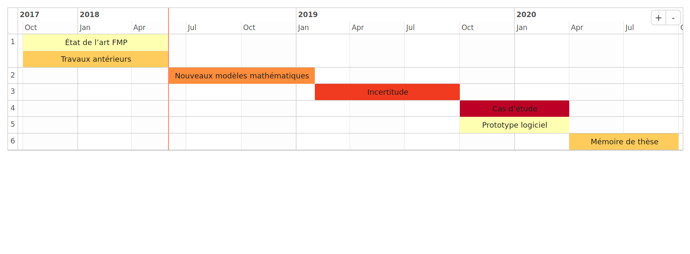

```{r setup, include=FALSE}
knitr::opts_chunk$set(echo = FALSE)
setwd("../")
source('functions/params.R')
source('functions/import_results.R')
source('diagrams/thesis_gantt.R')
exp_directory = PATHS[['experiments']] %>% paste0('201802141539/')
gantt <- print_solution(exp_directory, max_resources = 30)
gantt_th <- gantt_thesis()
show_gantt <- knitr::opts_knit$get("rmarkdown.pandoc.to")=="slidy"
```

# Introduction

## Planification Thèse
<!-- |Phase  | Libellé                        | Mois     | -->
<!-- |-------|--------| --------| -->
<!-- |1      | État de l’art FMP              | 1 – 8    | -->
<!-- |       | Travaux antérieurs             | 1 – 8    | -->
<!-- |2      | Nouveaux modèles mathématiques | 9 – 16   | -->
<!-- |3      | Incertitude                    | 17 – 24  | -->
<!-- |4      | Cas d’étude Armée de l’Air     | 25 – 30  | -->
<!-- |5      | Prototype logiciel             | 25 – 30  | -->
<!-- |6      | Mémoire de thèse               | 31 – 36  | -->

```{r, echo=FALSE, out.width='100%'}

if (show_gantt){
    # htmltools::HTML('<div style="font-size: 20px;width:100%">')
    gantt_th
    # htmltools::HTML("</div>")
} else {
    
}

```

# Problème

## Avions

Une flotte hétérogène d'avions, dont chacun a les caractéristiques suivantes :

* Butée calendrier.
* Butée horaire.
* Fonctionnalités.

## Missions

Un ensemble de missions à réaliser, chacune avec :

* Dates de début et fin.
* Un nombre nécessaire d'avions par mois.
* Une consommation d'heures par avion et par mois.
* Des fonctionnalités requises.

## Maintenances

Chaque maintenance suit les règles suivantes :

* La *durée est de 6 mois* consécutifs.
* Le nombre maximal d'heures de vol entre deux maintenances est *1000h*.
* Le nombre maximal de mois entre deux maintenances est *60 mois*.

## États possibles

En résumé, voici les états logiques possibles d'un aéronef :

- En mission.
- En maintenance.
- En stockage.
- Disponible.

## Objectifs

* Maximiser la disponibilité.
* Minimiser le coût (en réduisant le nombre de maintenances).

## Problème (exemple)


```{r, echo=FALSE, out.width='100%'}

if (show_gantt){
    # htmltools::HTML('<div style="font-size: 20px;width:100%">')
    gantt
    # htmltools::HTML("</div>")
} else {
    knitr::include_graphics('./../../img/calendar.png')
}

```

## Contraintes /  Règles / Objectifs

* RQ001: heures de missions.
* RQ002: aéronefs affectés.
* RQ003: besoins de maintenance.
* RQ004: durée de maintenance.
* RQ005: disponibilité.
* RQ006: capacité de maintenance.
* RQ007: état final.
* RQ008: stockage.

# État de l'art

## État de l'art (1)

> FMP: Flight and Maintenance Planning problem.

* Minimisation du nombre maximal de maintenances. Affectations quotidiennes. États-Unis, @Cho2011.
* Maximisation de disponibilité de vol. Affectations mensuelles Grèce, @Kozanidis2008.
* Minimisation du nombre maximal de maintenances. Affectations mensuelles. Pays-Bas. @Verhoeff2015.

## État de l'art (2)

Les travaux précédents:

* ont étudié de flottes homogènes: nous avons une flotte hétérogène.
* n'ont ni le mêmes contraintes ni les mêmes objectifs.
* n'affectent pas les avions aux missions.

# Modèle
## Modèle: fonction objectif

<div class="incremental">

\begin{align}
    & \text{Min}\; W_1 m_{max} + W_2 u_{max}
\end{align}

\pause

Minimiser le nombre maximal de maintenances et le nombre maximal de non-disponibilités.

\begin{align}
    &\sum_{t' \in \mathcal{T}^{s}_t} \sum_{i \in \mathcal{I}} m_{it'} + N_t \leq m_{max}
    &t \in \mathcal{T} \\
    &\sum_{t' \in \mathcal{T}^{s}_t} \sum_{i \in \mathcal{I}} m_{it'} + N_t + D_t\leq u_{max}
    &t \in \mathcal{T}
\end{align}

</div>

## Modèle: contraintes principales

Besoins des missions et incompatibilités entre les missions et les maintenances.

\begin{align}
&\sum_{i \in \mathcal{I}_j} a_{jti} = R_j
&j \in \mathcal{J}, t \in \mathcal{T}_j\\
&\sum_{t' \in \mathcal{T}^{s}_t} m_{it'} + \sum_{j \in \mathcal{J}_t \cap \mathcal{O}_i} a_{jti} \leq 1
& t \in \mathcal{T}, i \in \mathcal{I}
\end{align}

## Modèle: contraintes de flux

Calcul des heures de vol restantes pour chaque avion:

\begin{align}
& rut_{it} \leq rut_{it-1} + H m_{it} - \sum_{j \in \mathcal{J}_t \cap \mathcal{O}_i} a_{jti} H_j & t =1, ..., \mathcal{T}, i \in \mathcal{I}\\
& rut_{i0} = Rut^{Init}_i
        & i \in \mathcal{I}\\
& rut_{it} \geq H m_{it}
        & t \in \mathcal{T}, i \in \mathcal{I}\\
& rut_{it} \in [0,H]
        & t \in \mathcal{T}, i \in \mathcal{I} \\
& \sum_{i \in \mathcal{I}} rut_{it} \geq Rut^{Init}_{sum}
        & t = |\mathcal{T}|
\end{align}

# Résultats

## Expériences

Des instances ont déjà été testées:

| id | $\|\mathcal{J}\|$ |$\|\mathcal{T}\|$ |  assign |  objective  |  time (s) |   bound |
|-----|------------------|------------------|---------| ------------| -----------| --------|
| I_0 |                9 |               11 |     310 |        62.0 |        0.7 |    62.0 |
| I_1 |                9 |               21 |     650 |        63.0 |       68.7 |    63.0 |
| I_2 |                9 |               31 |     990 |        63.0 |     3600.1 |    62.0 |
| I_3 |                9 |               41 |    1249 |        64.0 |     3603.9 |    61.7 |
| I_4 |               10 |               11 |     530 |        82.0 |        0.9 |    82.0 |
| I_5 |               10 |               21 |    1070 |        83.0 |      144.0 |    83.0 |
| I_6 |               10 |               31 |    1610 |        83.0 |     3600.1 |    82.0 |
| I_7 |               10 |               41 |    2069 |        84.0 |     3609.1 |    81.8 |
| I_8 |               11 |               11 |    1080 |       139.0 |      530.6 |   139.0 |
| I_9 |               11 |               21 |    2120 |       149.0 |     3600.0 |   139.9 |

# Perspectives
## Perspectives

* **L'amélioration du modèle mathématique**: casser les symétries, reformuler les objectifs.
* **Solutions techniques alternatives**: essayer d'autres méthodes de résolution.
* **Continuer le dialogue avec les utilisateurs**: ajouter de nouvelles contraintes, valider les résultats.

# Références
## Références / Questions?

