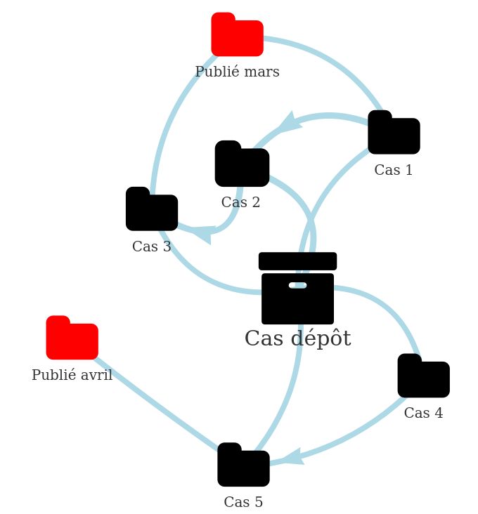

# Optiplan proposal

## Introduction

In this document we present the problem as the team understands it. The information used was the previous knowledge the team and the OptiPlan meeting in Paris.

Following, a technical proposal is presented that includes the functionalities a possible complete application would include based on the exchanges made during the OptiPlan day in Paris and from previous experiences the team has in building planning applications for industry.

Furthermore, the team's credentials are presented, mentioning the different projects and research that is relevant to the present project.

Finally, the technologies and tools to be used are presented, describing the use and justifying the choice at each point.

## Summary

The project presented is a web-based modern interactive application. It uses a mathematical model to generate new solutions, permits different users to access it with different access rights and provides powerful visualization to show, compare, and analyze plannings. It integrates with existing data sources (Excel file), new proposed ones (Excel template) and possible existing ones (other internal systems) as well as simple output (csv, json). Finally, it permits the use of cases to store information, making it easy to test, experiment and compare different scenarios.

We believe this team is uniquely well-positioned to tackle this project because of the following reasons:

* The team has more than 40 years of experience in the Operations Research field, which is the theory behind this problem.
* The team has years of experience in building planning and optimization software applications for a wide range of big industrial companies.
* The team has vast experience in both scientific articles and commercial projects related to planning and maintenance.
* The team has unique knowledge of the specific problem at hand, because a PhD thesis with this subject was started in October 2017 in collaboration with the DGA. Work was presented in ROADEF 2018 and is going to be presented in MOSIM 2018.

## Problem

<!-- TODO: translate into non-mathematical -->

The problem is considered a Flight and Maintenance Planning problem. Work has been already done by \citet{Kozanidis2008}, \citet{Cho2011}, \citet{Verhoeff2015} and \citet{Chastellux2016}, among others.

The problem consists in assigning aircraft to predefined missions and scheduling periodic preventive maintenances for these same aircraft.

Missions can only be understood as a budget of hours per month or per year. In this document we present the most general formulation possible, where missions are assigned to aircraft for one or more months.

### Missions

There is a fixed set of $j \in \mathcal{J}$ missions to be accomplished over an horizon of time divided into $t \in \mathcal{T}$ discrete periods. For their execution, these missions require the assignment of a specific number of aircraft $R_j$ each period of time the mission is active. The start and end periods for each mission are known and a mission is considered active between its start and end period.

During each period, missions consume an amount of time equal to $H_j$ hours from each of its assigned aircraft.

The assignment of an aircraft to a mission is not decided for the whole duration of the mission. After a minimum amount of time $MT_j$, an aircraft can be freed and exchanged for another one, even if the mission it is assigned to has not finished. 
The total number of aircraft being used at any given time in a specific mission should always be equal to $R_j$.

Each mission requires one and only one type of aircraft which, in addition, should comply with additional mission requirements.

### Aircraft

There is a set $i \in \mathcal{I}$ of available aircraft that are assigned to missions in order to accomplish them. Each aircraft can only be assigned to a single mission in any given period. These aircraft suffer from wear and tear and require regular maintenance operations during their lifetime. The need for maintenance is calculated based on two indicators.

The first one is called "remaining elapsed time" (or $ret_{it}$). It expresses the amount of time (measured in time periods) after which the aircraft cannot be used anymore and has to undergo a maintenance operation. Its value is calculated for each aircraft $i$ and each time period $t$. In a similar way, "remaining usage time" (or $rut_{it}$) is used to measure the amount of time that the aircraft $i$ can be used before needing a maintenance operation at any given period $t$.

Additionally, after an absolute amount of time and/or usage ($aet_i$ or $aut_i$), the aircraft becomes obsolete. There is no way to reverse this process.

At any given period, including at the start of the planning horizon, each aircraft has a specific status given by remaining usage time and remaining elapsed time.

### Maintenances

Maintenances operations are the process by which aircraft that have reached a limit in some indicator can return to a state where they can continue to be used in missions.

Each maintenance operation has a fix duration of $M$ periods.

After a maintenance operation, an aircraft restores its remaining elapsed time and remaining usage time to their max values $E$ (~60 months) and $H$ (~1200 hours) respectively.

There are also special maintenances that improve the aircraft capabilities (their ability to be assigned to new missions). These maintenances will be decided by the user and fixed for the application so they can be taken into account when assigning the rest of maintenances.

### Storages

Following the rule of remaining elapsed time, even if an aircraft is not being used, it still needs to have a maintenance after a given amount of time has passed. In order to avoid this problem, the aircraft can be put into a storage state.

A aircraft in this state has to be kept for a minimum time of $sm$ periods. While in this state it cannot receive maintenance or be assigned to any mission.

Every aircraft has the capacity to be stored and this capacity is measured in a number of periods $sc$. In order for an aircraft to restore its remaining storage capacity, it needs to receive a specific maintenance. Similar to the remaining elapsed time, the aircraft recovers its storage capacity up to a certain level $S$.

### Possible states

As a summary, the following are the possible logical states that an aircraft can be in: 

* Assigned to a mission.
* Receiving maintenance.
* Under storage.
* Available.

### Time

In planning missions and maintenances, it is important to take into account the initial and end state of each aircraft. This initial state can be a maintenance or an assigned mission. If an aircraft is already under maintenance, it needs to continue in this state for its remaining maintenance time. Tasks' assignments should be taken into account in a similar manner.

For planned maintenances whose starting time is close to the beginning of the planning horizon, they should also be considered fixed.

<!-- TODO: diagram -->

The remaining used and elapsed times are assigned to each aircraft at the beginning of the planning horizon.

Finally, the state of each aircraft at the end of the planning horizon, its remaining (elapsed, used) time, needs to be defined and taken into account.

### Objectives

The following objectives are considered, although more could be potentially added.

Given that the creation of new missions and the duration of maintenance are considered stochastic in real-life, one basic goal is to maximize the robustness of the planning by having the greatest amount of available aircraft at every period of the planning horizon. 

Given the limited amount of maintenance capacity and its cost, another goal is to smooth as much as possible the number of aircraft under maintenance over the planning horizon. Maintenances should also be controlled so it does not pass the maximum capacity.

### Proposal

A summary of the application's functionalities is shown in the following image:

### Usage

<!-- TODO: flowcharts! -->

### Cases and experimentation

Given the strategic nature of the application, it will be case-centric. This means that it will support saving all the relevant data (input and output) in a case. This way, different experiments could be done by copying and modifying an existing case. This is similar as working with multiple spreadsheets, each one with its own name, while sharing the same logic in one place.

The following figure shows an hypothetical set of cases already saved:

The following figure represents the possible interactions between cases. Case 1 was published for the month of March. During the month, it received some modifications, resulting in cases 2 and 3. Finally, Case 3 was (re)published for March.
Later, Case 4 was created and modified before publication to Case 5. Case 5 was published for April.

The available functionality will be the following:

1. Create a new empty case.
2. Copy an existing case.
3. Delete a case.
4. Compare two cases.
5. Publish a case.
6. Export a case.

#### Contents of a case

A case consists on all the information needed to construct a planning and one possible planning built from this information. This unit of storage permits to easily integrate with current data structures and run, compare different experiments.

More explicitly:

* Set of aircraft with their characteristics and historic information on them until a certain date.
* Set of missions or flight hours to do in the planning period.
* Assignments of aircraft to operations during the planning horizon.
* Future maintenance schedules.
* Configuration such as maintenance duration, flight hours after a maintenance, etc.

#### Comparison of cases

This functionality will potentially work in several levels depending on the final needs of the client.
One option would be to visualize the differences in input data for two cases.
Another option would be to visualize the differences in the resulting planning for the two cases.
Finally, it could be interesting to compare specific KPI for two or more cases, in order to choose the best scenario.

#### Published case

A situation that is common in the creation of plannings is the fact that several different cases may exist but it is still important to identify which one is the 'active' one. In order to deal with this, a simple publication system will be included in the application, where the 'planner' (see *Users* section) can identify the case that should be shared with others.

### Graphic User Interface (GUI)

All interaction from the user with the application will be done via an HTML application.

Besides showing data in interactive tables, specific alternatives can be incorporated to make the usage easier.

Here are some examples of available functionality:

Here, an interactive gantt is used to present and potentially modify a maintenance plan:

<!-- TODO: gantt example -->

Here, an interactive graph is used to present the usage of aircraft:

<!-- TODO: rut example -->

Here, an interactive table is used to present the usage of aircraft:

<!-- TODO: DT example -->

### Data integration

The application will include its own data storage through a database. All information used by the application will be stored here. In addition to this system, the application will permit several ways to import and export data from it.

#### Importing data

A new case can be created from the following options:

* The Excel file that is currently being used.
* An new yet-to-be-created Excel template file.

In addition to this, the historic data could be potential read from another system, if available.

#### Exporting data

The data in a case will be able to be exported in the following ways:

* In the *current Excel* format (or one that is similar).
* Into the new Excel template that is will be created.
* csv and/ or json files if needed.

### Architecture and deployment

The application will be deployed via a client-server architecture. This way, it would be easy to share the application given that it will only require having a modern web browser installed (Google Chrome).

The server should be installed somewhere inside the client's infrastructure.

The default requirements for the server are:

* Ubuntu Server 64 bits.
* Cores >= 4
* RAM >= 8GB
* Hard drive >= 500 GB

Depending on the future integration, additional data flows will be included in the design. The only known data flow is between the existing Excel file and the application.

The following figure shows a summary of the architecture to be implemented and the data flows between components.

Users will interact via web browsers with the server. In order to load new data they can upload a new Excel file with the relevant data or edit an existing case via the application.

The server will be in charge of solving and generating new planning solutions and storing all relevant information in its database.

Users will be able to recover visually the results. Also, they will be able to export the results into csv, Excel and json formats depending on their needs.

This client-server architecture provides several advantages:

* Powerful graphics can be incorporated via open source javascript libraries.
* It is easier to maintain as a clear separation of concerns is done between GUI, logic and model.
* No installation of software besides a modern web browser is required.
* Multiple users can be easily incorporated.
* Integration with other systems can be done with minimal changes to the existing IT.
* Powerful resources can be allocated where needed (server) instead of the users pcs.

### Users

Two possible roles are identified for the users of this application.

The first one will be called "planner". This user is in charge of creating (manually or automatically) different plannings.
The second one will be called "viewer". This user will be able to visualize the results of the planning created and stored inside the application. 
Depending on the needs of the client, several "viewer" profiles could be created in order to share only parts of the stored information with each profile.

## Team

<!-- TODO: names, CV and résumés-->

* Operations research experts.
* Familiar with maintenance planning.
* With experience building applications for industrial clients.
* Direct experience with the problem at hand.

### Alain Haït

### Olga Battaïa

### Franco Peschiera

Franco has been working in the Operations Research industry for almost 7 years. During which he has been the Chief Technical Officer for a Spanish startup that builds software applications with mathematical optimization or simulation models inside for several big Spanish and international companies. Examples of clients have been: Repsol and CLH (oil logistics, marketing, human resources), General Motors, L.I. Lilly and Air Liquide (production planning), Alstom and ASM (logistics and transportation) among many others.

Franco started a PhD at ISAE-SUPAERO university in October 2017 on the topic of military aircraft maintenance planning.

## Technologies and techniques

* **Mathematical Modeling** to solve the problem.
* **Python** for modeling, heuristics and data integration.
* **R** for statistics, possible forecasting and data visualization.
* **PostgreSQL** for storing data.
* **HTML5** for reports, visualization.

### Mathematical modeling

Mathematical modeling is a technique that is part of the branch of Operations Research in mathematics. It permits the construction of a set of equations to represent a specific well-defined situation and the use of advanced state of the art programs to search for and find the best solution that takes respects these equations. These programs (solvers) are available both in commercial and open source (free).

Advantages of using this technique compared to other alternatives are that it can prove the optimality of a solution, it can incorporate multiple objectives easily and it is possible to easily fix certain decisions that are already taken, making it possible to have interactive user-model use cases. With little modifications, it can be reused to take into account different situations.

Other functionality also includes having time limits and other more complex stop conditions.

### Python

python permits at the same time rapid prototyping as well as good code syntax. It offer a extremely wide offer of libraries and, in particular, it includes the best APIs to solver and non commercial solvers for Mixed Integer Programming problems.

It also excels at web developing with libraries such as flask and jinja templates.

### R

R is the state of the art in statistics and forecasting modelling. It includes several libraries for data manipulation, visualization and, as a programming language, good integrations with other languages and software.

Finally, it offers specially good integration with html-based applications via the [Shiny](https://shiny.rstudio.com/) technology.

### PostgreSQL

PostgreSQL is one of the most well-known open-source database alternatives. It includes many functionalities that are not present in other database engines (namely MySQL) such as:

* NoSQL storing (for cases, for example).
* window-functions integrated with R.

### HTML5

HTML 5 is the most recent change to the HTML that incorporates graphical functionality. This standard has permited a multitude of open sourced libraries that offer very powerful interactive graphics that are easily incorporated into webpages.

Examples of these libraries are: [leaflet](http://leafletjs.com/), [visjs](visjs.org), [d3js](https://d3js.org/) among many others.
