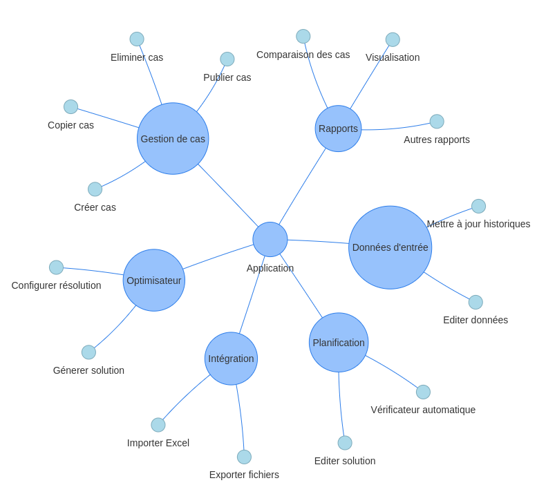
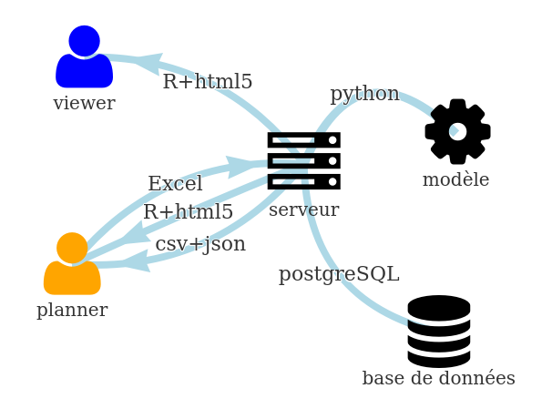

```{r setup, include=FALSE}
knitr::opts_chunk$set(echo = FALSE)
setwd("../")
source('scripts/params.R')
source('scripts/import_results.R')
source('diagrams/cases.R')
source("diagrams/architecture.R")
source("diagrams/functionalities.R")
source('diagrams/exampleDT.R')
source('diagrams/gantt_tasks.R')
exp_directory = PATHS[['experiments']] %>% paste0('201802141539/')
exp_directory2 = PATHS[['experiments']] %>% paste0('201802061201/')
gantt <- print_solution(exp_directory, max_resources = 5, width="100%", height="200px")
gantt_tasks <- print_tasks(exp_directory2, width="100%", height="200px", max_tasks = 5)
graphs_rem <- graph_remaining(exp_directory)
table_rem <- table_remaining(exp_directory)
html_output <- knitr::opts_knit$get("rmarkdown.pandoc.to") %in% c("slidy", 'html')
```

<!-- TODO: check if all points from the rules are covered -->

## Introduction 


Dans ce document, nous présentons d'abord le problème tel que l'équipe le comprend. Les sources d'information sont la connaissance préliminaire de l'équipe et la réunion OptiPlan qui a eu lieu à Paris.

Une proposition technique est présentée qui inclut les fonctionnalités qu'une éventuelle application complète inclurait sur la base des échanges effectués lors de la journée OptiPlan à Paris et des expériences précédentes de l'équipe dans la construction d'applications d'aide à la planification pour l'industrie.

Ensuite, les références de l'équipe sont présentées, mentionnant les différents projets et recherches pertinents liés au présent projet.

Une planification de temps est présenté pour le développement du logiciel prototype, avec les livrables par étape.

Enfin, les technologies et les outils logiciels à utiliser sont présentés, décrivant l'utilisation et justifiant le choix à chaque point.

## Résumé

Le projet présenté est une application web interactive. Il utilise un modèle mathématique pour générer de nouvelles solutions, permet à différents utilisateurs d'y accéder avec différents droits d'accès et offre une puissante visualisation pour afficher, comparer et analyser les planifications. Il s'intègre aux sources de données existantes (fichier Excel), aux nouvelles proposées (modèle Excel) et a la possibilité de s’intégrer aux sources existantes (autres systèmes internes) ainsi qu'à la sortie simple (csv, json). Enfin, il permet l'utilisation de cas pour stocker des informations, ce qui facilite les essaies, l'expérimentation et la comparaison de différents scénarios.

Nous pensons que cette équipe est particulièrement bien placée pour aborder ce projet pour les raisons suivantes:

* L'équipe somme plus de 40 ans d'expérience dans le domaine de la recherche opérationnelle, qui est la théorie de bas derrière ce problème.
* L'équipe possède des années d'expérience dans la conception d'applications logicielles de planification et d'optimisation pour un large ensemble de grandes entreprises industrielles.
* L'équipe possède une vaste expérience produisant articles scientifiques et projets commerciaux liés à la planification et à la maintenance.
* L'équipe a une connaissance unique du problème spécifique, car une thèse de doctorat sur ce sujet a été lancée en octobre 2017. Les travaux ont été présentés déjà à la conference ROADEF 2018 et seront présentés dans la conférence MOSIM 2018.

## Problème

L'Armée de l'Air dispose d'une flotte d'avions Mirage 2000 de différents types, avec des fonctionnalités particulaires et avec un état d'opération spécifique donné par certains indicateurs temporelles d'usage.

Au même temps, il existe un besoin opérationnel généré par les différents missions que la flotte doit être capable de remplir. Ce besoin peut être formulé comme un nombre de missions à satisfaire ou un budget d'heures de vol a atteindre à chaque période.

Finalement, il existe de contraintes opératifs du au fait que les avions ont besoin de maintenances régulières et possibles stockages pour être conservés en bon état et, de cette façon, garantir la capacité future de la flotte.

Le problème consiste, donc, à affecter des avions aux missions prédéfinies et à programmer des opérations de maintenance préventive pour ces mêmes avions de façon d'avoir le plus grand quantité d'avions disponibles en lissant et réduisant les opérations de maintenance le plus possible dans le temps, sans impacter la capacité de la flotte présent ou future.

Dans la littérature, le problème est considéré comme un problème de planification de vol et de maintenance (Flight and Maintenance Planning problem). Travail a déjà été fait par @Kozanidis2008, @Cho2011, @Verhoeff2015, entre autres.

### Avions

Il y a un ensemble $i \in \mathcal{I}$ des avions disponibles à être affectés aux missions. Chaque avion ne peut être affecté qu'à une seule mission au cours d'une période donnée. Ces avions souffrent d'usure et nécessitent des opérations de maintenance régulières pendant leur durée de vie. Le besoin de maintenance est calculé sur la base de deux indicateurs.

Le premier est appelé "temps écoulé restant" (ou $ret_{it}$). Il exprime la durée (mesurée en périodes) après laquelle l'aéronef ne peut plus être utilisé et doit subir une opération de maintenance. Sa valeur est calculée pour chaque avion   $i$ et chaque période de temps $t$. De la même manière, "temps d'utilisation restant" (ou $rut_{it}$) est utilisé pour mesurer la quantité de temps que l'avion $i$ peut être utilisé avant d'avoir besoin d'une opération de maintenance à une période donnée $t$.

De plus, après une quantité absolue de temps et / ou d'utilisation ($aet_i$ ou $aut_i$), l'aéronef devient obsolète. Il n'y a aucun moyen d'inverser ce processus.

À toute période donnée, y compris au début de l'horizon de planification, chaque aéronef a un statut spécifique donné par le temps d'utilisation restant et le temps écoulé restant.

### Missions

Dans ce document, nous présentons la formulation la plus générale possible, où les missions sont affectés aux avions pour un ou plusieurs mois.

Il y a un ensemble fixe de $j \in \mathcal{J}$ missions à accomplir sur un horizon de temps divisé en $t \in \mathcal{T}$ périodes discrètes. Pour leur exécution, ces missions nécessitent l'attribution d'un nombre spécifique d'aéronefs $R_j$ chaque période de temps la mission est active. Les périodes de début et de fin de chaque mission sont connues et une mission est considérée comme active dans les mois entre sa période de début et sa fin.

Au cours de chaque période, les missions consomment une quantité de temps égale à $H_j$ heures de chacun de ses avions affectés.

L'affectation d'un avion à une mission n'est pas décidée pour toute la durée de la mission. Après un minimum de temps $MT_j$, un aéronef peut être libéré et échangé par un autre, même si la mission à laquelle il est affecté n'a pas terminée. Le nombre total d'avions affectés à un moment donné à chaque mission doit toujours être égal à $R_j$.

Chaque mission nécessite un et un seul type d'aéronef qui, de plus, doit satisfaire à des exigences de mission supplémentaires.

```{r, echo=FALSE, out.width='90%'}
if (html_output){
    gantt_tasks
} else {
    knitr::include_graphics('../../img/tasks_gantt.png')
}
```

    Graphique montrant possibles missions et ses besoins.

### Maintenances

Les opérations de maintenance sont le processus par lequel les aéronefs qui ont atteint une limite dans certains indicateurs peuvent revenir à un état où ils peuvent continuer à être utilisés dans les missions.

Chaque opération de maintenance a une durée fixe de $M$ périodes.

Après une opération de maintenance, un aéronef restaure le temps écoulé restant et le temps d'utilisation restant à leurs valeurs maximales $E$ (~ 60 mois) et $H$ (~ 1200 heures) respectivement.

Il existe également des opérations de maintenance spéciales qui améliorent les capacités de l'avion (ils améliorent leur capacité à être affecté à de nouvelles missions). Ces opérations seront décidées par l'utilisateur et fixées pour l'application afin qu'elles puissent être prises en compte lors de l'attribution du reste des opérations de maintenance.

### Stockages

Conformément à la règle du temps écoulé, même si un aéronef n'est pas utilisé, il doit encore subir un opération de maintenance après un certain temps. Afin d'éviter ce problème, l'aéronef peut être mis dans un état de stockage.

Un aéronef dans cet état doit être gardé pendant un temps minimum de $sm$ périodes. Dans cet état, il ne peut pas recevoir de maintenance ou être affecté à une mission.

Chaque avion a une certaine capacité d'être stocké et cette capacité est mesurée en un nombre de périodes $sc$. Pour qu'un aéronef restaure sa capacité de stockage restante, il doit recevoir une opération de maintenance spécifique où l'avion récupère sa capacité de stockage jusqu'à un certain niveau $S$.

### États possibles

En résumé, voici les états logiques possibles d'un aéronef:

* Assigné à une mission.
* Réception de maintenance
* Sous stockage
* Disponible.

### Temps

Lors de la planification des missions et des opérations de maintenance, il est important de prendre en compte l'état initial et final de chaque aéronef. Cet état initial peut être une maintenance ou une mission assignée. Si un aéronef est déjà en maintenance, il doit continuer dans cet état pour son temps de maintenance restant. Les missions affectés doivent être prises en compte de la même manière.

Pour les opérations de maintenance planifiées dont l'heure de début est proche du début de l'horizon de planification, elles doivent également être considérées comme fixes.

Les temps (écoulé et d'utilisation) restants sont assignés à chaque aéronef au début de l'horizon de planification.

Enfin, l'état de chaque aéronef à la fin de l'horizon de planification, ses temps restant (écoulé, utilisé), doivent être défini et pris en compte.

### Objectifs

Les objectifs suivants sont considérés, bien que d'autres pourraient potentiellement être ajoutés.

Étant donné que la possibilité de nouvelles missions et la durée de l'opération de maintenance sont considérées stochastiques dans la vie réelle, un objectif fondamental est de maximiser la robustesse de la planification en ayant la plus grande quantité d'avions disponibles à chaque période de l'horizon de planification.

Compte tenu de la capacité limitée pour faire opérations de maintenance et de son coût, un autre objectif consiste à lisser le plus possible le nombre d'avions sous maintenance dans l'horizon de planification. Les opérations de maintenance doivent également être contrôlées afin de ne pas dépasser la capacité maximale.

## Proposition

Un résumé des fonctionnalités de l'application est montré dans l'image suivante:

```{r, echo=FALSE, out.width='90%'}
if (html_output){
    graph_functionalities()
} else {
    
}
```

    Graphique montrant les fonctionnalités de l'application.


### Optimiseur

Le modèle conçu pour générer de nouvelles solutions sera conforme aux exigences décrites ci-dessous.


#### RQ001: heures de missions

Chaque mois, toutes les missions doivent être satisfaites grâce à l'affectation des suffisamment d'heures de vol à chaque avion.

#### RQ002: aéronefs assignés

Chaque mois, toutes les missions doivent avoir un nombre minimum d'avions affectés.

#### RQ003: besoins de maintenance

Chaque avion doit toujours avoir suffisamment de "temps d'utilisation restant" pour pouvoir effectuer les missions requises. Afin de récupérer des heures de vol (environ 1200 heures), une opération de maintenance est nécessaire.

De même, après un certain temps, les aéronefs ont besoin d'un entretien même s'ils n'ont pas atteint cette limite d'heures de vol. Cette durée est d'environ 5 ans.

#### RQ004: durée de maintenance

Les opérations de maintenance prennent environ 5 mois et une fois qu'un avion a commencé l'opération de maintenance, il doit la continuer. Il ne peut pas être affectés aux missions pendant la durée de la opération de maintenance.

#### RQ005: disponibilité

Chaque mois, il est important d'avoir le plus grand nombre possible d'avions disponibles prêts à s'engager dans une nouvelle mission.

#### RQ006: capacité de maintenance

Les opérations de maintenance à planifier pour tous les avions doivent être effectuées de la manière la plus lissé possible, en évitant avoir des mois spécifiques avec un grand quantité des opérations de maintenance.

En d'autres termes, il est important d'avoir le nombre le plus bas possible d'avions sous maintenance à chaque mois.

#### RQ007: état final

À la fin de l'horizon de planification, l'avion doit être dans le meilleur état possible. Cela implique que, en moyenne, les avions doivent avoir un gros budget d'heures de vol restant (temps d'utilisation restant) et un grand nombre de mois (temps écoulé restant) avant d'avoir besoin d'un entretien.

#### RQ008: stockage

Le stockage peut être décidé par le modèle afin d'éviter la détérioration de l'aéronef. Le nombre de périodes minimale de stockage d'un avion est de 6 mois et, dans cet état, l'avion n'est pas disponible ni pour recevoir un maintenance ni pour faire une mission.

#### RQ009: fixation des parties de la planification

Il existe plusieurs raisons pour lesquelles l'utilisateur peut avoir besoin de fixer une partie d'une planification précédente. Par exemple, certaines opérations de maintenance sont déjà décidées et doivent avoir lieu à l'avenir dans de dates spécifiques. Certains avions sont déjà en mission ou sous maintenance et doivent y rester au moins quelques mois dans cet état. En outre, le stockage peut être déjà décidé ou en cours.

Une autre raison de la fixation des opérations de maintenance pourrait être pour les opérations d'amélioration planifiées aux aéronefs. Ces types spéciaux d'opérations de maintenance sont décidés plusieurs mois à l'avance pour certains avions sélectionnés.

Ces assignations fixes seront communiquées au optimiseur afin qu'il ne les change pas.

#### RQ010: configuration

Les options disponibles seront, par défaut:

<!-- rut, ret -->
* **Temps maximum**: dans le cas où une solution est nécessaire avant de prouver l'optimalité.
* **Maximal GAP**: afin d'autoriser une distance maximal entre la meilleure solution obtenue et la meilleure solution hypothétique possible. Cette distance peut être une différence proportionnelle ou une différence absolue.
* **Premier et dernier mois a planifier**: afin de définir l'horizon de planification à planifier.
* **Poids des objectifs**: pour optimiser les différents objectifs et privilégier un ou autre objectif.
* **Paramètres de maintenance**: durée de maintenance (en mois), temps d'utilisation maximal, temps écoulé maximal et d'autres paramètres liés à la maintenance.

### Cas et expérimentation

Étant donné la nature stratégique de l'application, elle sera centrée sur les cas. Cela signifie qu'il permettra de sauvegarder toutes les données pertinentes (entrée et sortie) dans le même cas. De cette façon, différentes expériences pourraient être faites en copiant et en modifiant un cas existant. Ceci est similaire à travailler avec plusieurs feuilles de calcul, chacune avec son propre nom, tout en partageant la même logique en un seul endroit.

La figure suivante montre un ensemble hypothétique de cas déjà enregistrés. Elle représente les interactions possibles entre les cas. Le cas 1 a été publié pour le mois de mars. Au cours du mois, il a reçu quelques modifications, ce qui a entraîné les cas 2 et 3. Enfin, le cas 3 a été re-publié pour le mois de mars. Plus tard, le cas 4 a été créé et modifié sans être publié dans le cas 5. Le cas 5 a été publié en avril.

```{r, echo=FALSE, out.width='70%'}
if (html_output){
    graph_cases()
} else {
    knitr::include_graphics('../../img/cases.png')
}
```

    Exemple montrant l'interaction entre les cas et la publication des cas.

Les fonctionnalités disponibles seront les suivantes:

* Créer un nouveau cas.
* Copier un cas existant.
* Supprimer un cas.
* Comparer deux cas.
* Publier un cas.
* Exporter un cas.

#### Contenu d'une cas

Un cas consiste, au même temps, de toutes les informations nécessaires pour construire une planification et une planification réalisable construite à partir de cette information. 

Cette unité de stockage permet de s'intégrer facilement aux structures de données actuelles.

Plus explicitement, un cas consiste en:

* L'ensemble d'avions avec leurs caractéristiques et leurs informations historiques jusqu'à une certaine date.
* L'ensemble de missions ou d'heures de vol à faire dans la période de planification.
* Une pre-affectation d'aéronefs à des opérations pendant l'horizon de planification.
* Futurs calendriers de maintenance.
* Configuration comme la durée de maintenance, les heures de vol après une maintenance, etc.
* Une planification (généré manuellement ou avec l'Optimiseur).

#### Comparaison des cas

Cette fonctionnalité peut potentiellement avoir plusieurs utilisations en fonction des besoins finaux du client. Une option serait de visualiser les différences dans les données d'entrée pour deux cas. Une autre option consisterait à visualiser les différences dans la planification résultante pour les deux cas. Enfin, il pourrait être intéressant de comparer des KPI (Key Performance Indicators) spécifiques pour deux cas, afin de sélectionner le meilleur scénario.

#### Publications de cas

Une situation courante dans la création de planifications est le fait que plusieurs cas différents peuvent exister mais il est toujours important d'identifier lequel est le cas 'actif'. Pour faire face à cela, un système de publication simple sera inclus dans l'application, où le «planificateur» (voir la section "Utilisateurs") peut identifier le cas qui devrait être partagé avec d'autres.

### Interface graphique utilisateur (GUI)

Toute interaction de l'utilisateur avec l'application se fera via une application HTML.

En plus de montrer des données dans des tableaux interactifs, des alternatives graphiques spécifiques peuvent être incorporées pour rendre l'utilisation plus facile et plus efficace.

Voici quelques exemples de fonctionnalités disponibles.

Ici, un gantt interactif est utilisé pour présenter et éventuellement modifier un plan de maintenance. Il est possible d'éditer les opérations de maintenance et l’affection aux missions (changer la taille ou la déplacer) en double-cliquant dessus et en faisant glisser. En outre, il est possible d'ajouter de nouvelles affectations en double-cliquant.

```{r, echo=FALSE, out.width='70%'}

if (html_output){
    gantt
} else {
    
}
```

    Exemple de Gantt interactif.

Ici, un graphique interactif est utilisé pour présenter l'évolution du statut d'un seul avion au fil du temps. Il est possible de filtrer, faire zoom et exporter en tant qu'image.

```{r, echo=FALSE, out.width='90%'}

if (html_output){
    graphs_rem
} else {
    
}
```

    Exemple de graphique interactif.

Ici, une table interactive est utilisée pour présenter certaines données. Il est possible d'éditer le contenu, de filtrer, de réorganiser les données, etc.

```{r, echo=FALSE, out.width='90%'}

if (html_output){
    table_rem
} else {
    
}
```

    Exemple de table interactive.


### Intégration de données

L'application inclura son propre stockage de données à travers d'une base de données. Toutes les informations utilisées par l'application seront stockées ici. En plus de ce système, l'application permettra plusieurs façons d'importer et d'exporter des données à partir de ce système.

#### Importer des données

Un nouveau cas peut être créé à partir des options suivantes:

* Le fichier Excel actuellement utilisé.
* Un nouveau fichier modèle Excel à créer.
* Les données historiques pourraient être lues par un autre système, si disponible.

#### Exporter des données

Les données dans un cas pourront être exportées de la manière suivante:

* Dans le format d l'Excel actuel (ou un format similaire).
* Dans le nouveau template Excel qui sera créé.
* Fichiers csv et / ou json si nécessaire.
* Ces capacités d'exportation permettront également de partager des informations partielles avec d'autres acteurs dans des fichiers Excel ou plats.

### Architecture et déploiement

L'application sera déployée via une architecture client-serveur. De cette façon, il serait facile de partager l'application étant donné que cela nécessitera seulement l'installation d'un navigateur web moderne (Google Chrome).

Le serveur devra être installé quelque part dans l'infrastructure du client.

La configuration matérielle minimale requise pour le serveur est la suivante:

* Ubuntu Server 64 bits.
* Noyaux> = 4
* RAM> = 8 Go
* Disque dur> = 500 Go

Les exigences logicielles minimales pour le serveur sont les suivants:

* R + Shiny Server
* python> = 3.6
* PostgreSQL

Des logiciels supplémentaires pourraient être nécessaires en fonction des spécifications finales. Par exemple, dans le cas où le modèle soit trop gros pour les solveurs de source libre, un solveur commercial pourrait être nécessaire.

En fonction de la future intégration, des flux de données supplémentaires seront inclus dans la conception. Le seul flux de données connu se situe entre le fichier Excel existant et l'application.

La figure suivante présente un résumé de l'architecture à mettre en œuvre et des flux de données entre les composants.

```{r, echo=FALSE, out.width='70%'}

if (html_output){
    graph_architecture()
    
} else {
    
}
```

    Architecture proposée avec flux de données entre composants.

Les utilisateurs interagiront via les navigateurs Web avec le serveur. Pour charger de nouvelles données, ils peuvent charger un nouveau fichier Excel avec les données pertinentes ou éditer un cas existant via l'application.

Le serveur sera chargé de résoudre et de générer de nouvelles solutions de planification et de stocker toutes les informations pertinentes dans sa base de données.

Les utilisateurs seront en mesure de récupérer visuellement les résultats. En outre, ils seront en mesure d'exporter les résultats en formats csv, Excel et json en fonction de leurs besoins.

Cette architecture client-serveur offre plusieurs avantages:

* Des graphiques puissants peuvent être incorporés via des bibliothèques javascript et HTML.
* Il est plus facile à maintenir car une séparation claire des fonctionnalités est faite entre l'interface graphique, la logique d'utilisation et l'Optimiseur.
* Aucune installation de logiciel additionnel à un navigateur Web moderne n'est requise.
* Plusieurs utilisateurs peuvent être facilement incorporés.
* L'intégration avec d'autres systèmes peut être effectuée avec des changements minimes à la structure existante.
* Des ressources puissantes peuvent être allouées si nécessaire au niveau du serveur au lieu des devoir changer les ordinateurs des utilisateurs.
* En plus de cela, il n'y a pas de logiciel tiers à acheter. Tous les composants sont open source. La seule exception possible pourrait être le solveur mathématique, en fonction de la taille du problème et les besoins de performance.

### Utilisateurs

Deux rôles possibles sont identifiés pour les utilisateurs de cette application.

Le premier s'appellera "planificateur". Cet utilisateur est en charge de créer (manuellement ou automatiquement) des plannings différents. Le second s'appellera "spectateur". Cet utilisateur pourra visualiser les résultats de la planification créée et stockée dans l'application. En fonction des besoins du client, plusieurs profils "spectateur" pourraient être créés afin de partager quelques parties des informations stockées avec chaque profil.

## Équipe

### Alain Haït

### Olga Battaïa

### Franco Peschiera

Un ingénieur industriel, mathématicien de profession et programmeur par cœur.

Franco a travaillé dans l'industrie de la recherche opérationnelle depuis près de 7 ans. Au cours de ce temps il a été le propriétaire et le directeur technique pour une startup espagnole (www.baobabsoluciones.es), en construisant des applications logicielles avec des modèles d'optimisation mathématique ou de simulation à l'intérieur pour plusieurs grandes entreprises espagnoles et internationales. Exemples de clients sont: Repsol et CLH (logistique pétrolière, marketing, ressources humaines), General Motors, LI Lilly et Air Liquide (planning de production), RATP, Alstom et ASM (logistique et transport) parmi plusieurs autres.

Ces projets comportaient la liste suivante de tâches: la spécification des besoins du client, la construction d'un modèle mathématique ou de simulation, la programmation d'une interface utilisateur graphique, le déploiement et l'intégration avec les systèmes informatiques, la documentation et la formation des utilisateurs.

Franco a commencé un doctorat à l'université ISAE-SUPAERO en octobre 2017 sur le sujet de la planification de la maintenance des avions militaires.

## Planification

Ici, les tâches requises avec leur ordre sont présentées. Le principal risque sur la planification actuelle est l'information incomplète sur:

* le problème spécifique à résoudre.
* l'infrastructure informatique disponible du client.
* la disponibilité des utilisateurs potentiels pour discuter des exemples de solutions et tester et évaluer les fonctionnalités faits.

On présente une proposition de planification basé en expériences précédents. La planification dépendra de la voie de communication finalement choisi et la disponibilité du client.

### Phase 1: exigences

Au cours de cette phase, des réunions en personne et par téléphone seront prévues.

Les conditions requises pour cette phase sont: *Aucun*.

Le livrable de cette phase sera:

* un document avec une description accordé sur les exigences minimales pour le prototype et
* un document d'exigences additionnelles à préciser ultérieurement.

La durée de cette phase est estimée à: *3 semaines*.

### Phase 2: première itération

Dans cette phase, une première version du prototype sera construite et déployée.

Les conditions requises pour cette phase sont:

* la liste avec des exigences minimales.
* une alternative de déploiement pour partager l'application avec les utilisateurs.

Le livrable de cette phase sera:

* une application prototype que les utilisateurs peuvent utiliser et tester.
* exemples de solutions pour les utilisateurs à analyser.

La durée de cette phase est estimée à: *5 semaines*.

### Phase 3: deuxième itération

Dans cette phase, une version finale du prototype sera construite et déployée. En fonction de niveau d'implication du client, le types de changements à réaliser et l'urgence, cette phase pourrait être coupé en deux phases de la moitié de durée.

Les conditions requises pour cette phase sont:

* une liste avec les changements à faire à la première version basée sur les commentaires des utilisateurs.
* une liste avec des fonctionnalités supplémentaires à ajouter.

Le livrable de cette phase sera:

* une nouvelle version de l'application que les utilisateurs pourront utiliser.
* la documentation technique.
* la Guide de l'utilisateur.

La durée de cette phase est estimée à: *5 semaines*.

### Profils et engagement

Il y aura trois profils dans ce projet:

* Profil 1: Consultant Senior spécialisé en Recherche Opérationnelle (RO).
* Profil 2: Développeur Senior spécialisé en RO.
* Profil 3: Chef de projet spécialise en RO.

Dans le tableau ci-dessous sont les engagements hebdomadaires estimés de profils:

| Phase | Durée | Profil 1 | Profil 2 | Profil 3
|-------|----------|----------|----------|---------|
|Phase 1| 3 semaines| 4 h    | 30 h    | 8 h     |
|Phase 2| 5 semaines| 2 h    | 30 h    | 8 h     |
|Phase 3| 5 semaines| 2 h    | 30 h    | 8 h     |

### Estimation économique

Basé en la définition de profils et les engagements déjà présente, le montant correspondant au projet de développement du prototype est de 55.600€.

## Technologies et techniques

* **Modélisation mathématique**: pour générer des planifications.
    * **Solveur mathématique**: pour générer les planifications. Cela pourrait être CBC, GUROBI ou CPLEX en fonction de besoins du modèle.
* **Python**: pour la modélisation, l'heuristique et l'intégration de données.
* **R**: pour les statistiques, possibles prévisions et la visualisation des données.
* **PostgreSQL**: pour stocker des données.
* **HTML5**: pour les rapports, et les visualisations.

### Modélisation mathématique

La modélisation mathématique est une technique qui fait partie de la branche de la recherche opérationnelle en mathématiques. Il permet la construction d'un ensemble d'équations pour représenter une situation spécifique bien définie et il permet l'utilisation de logiciels de avancés pour rechercher et trouver la meilleure solution qui respecte ces équations. Ces logiciels (modélisateurs et solveurs) sont disponibles à la fois en version commerciale et open source (gratuite).

Les avantages de l'utilisation de cette technique par rapport à d'autres alternatives sont qu'elle peut prouver l'optimalité d'une solution, elle peut facilement incorporer plusieurs objectifs et il est possible de fixer facilement certaines décisions déjà prises, rendant possible l'utilisation interactive du modèle par l'utilisateur. Avec peu de modifications, le modèle peut aussi être réutilisé pour prendre en compte différentes situations qui ne soient si différentes de la situation originelle.

D'autres fonctionnalités incluent également des limites de temps et d'autres conditions d'arrêt plus complexes.

### Python

Python permet le prototypage rapide ainsi qu'une bonne syntaxe de code. Il offre une extrêmement large ensemble des bibliothèques et, en particulier, il inclut les meilleures API pour les solveurs commerciaux et non commerciaux pour les problèmes d'optimisation.

Il excelle également au développement de Web avec des bibliothèques très connus.

### R

R est l'état de l'art en matière de statistiques et de modélisation prévisionnelle. Il comprend plusieurs bibliothèques pour la manipulation des données, la visualisation et, en tant que langage de programmation, une bonne intégration avec d'autres langages et logiciels.

Enfin, il offre une intégration particulièrement bonne avec les applications HTML via le module [Shiny](https://shiny.rstudio.com/gallery/), qui sera utilisée dans ce projet.

### PostgreSQL

PostgreSQL est l'une des alternatives de base de données open-source les plus connues. Il comprend nombreuses fonctionnalités qui ne sont pas présentes dans d'autres moteurs de base de données (à savoir MySQL) tels que:

* NoSQL stockage.
* Fonctions de fenêtre intégrées à R.

### HTML5

HTML 5 est le changement le plus récent au HTML qui intègre des fonctionnalités graphiques. Cette norme a permis une multitude de bibliothèques à source ouverte qui offrent des graphiques interactifs très puissants qui sont facilement incorporés dans les pages Web.

Des exemples de ces bibliothèques sont: [leaflet](http://leafletjs.com/), [visjs](visjs.org), [d3js](https://d3js.org/) parmi beaucoup d'autres.

## Avertissements

1. La proposition présentée ci-dessus est destinée à une application complète livrée dans le cadre d'un projet complet au client.
1. Le prototype à livrer n'inclura pas toutes les fonctionnalités mentionnées dans ce document mais montrera des exemples des fonctionnalités les plus importantes suite à une réunion avec les futurs utilisateurs et décideurs.
1. L'intégration avec d'autres systèmes est hors de la portée de cette proposition car plus d'informations sont nécessaires concernant les systèmes existants pour pouvoir estimer la charge de travail.
1. Il est supposé que le client fournira les exigences hardware ainsi que les droits d'accès et les autorisations pour installer tous les composants du logiciel. Alternativement, le logiciel pourrait être installé dans le cloud.
1. Même si la programmation mathématique offre la capacité de prouver l'optimalité d'une solution, l'application ne garantit pas la trouver dans tous les cas. La qualité des solutions et le temps nécessaire pour les obtenir dépendront de nombreux facteurs; la taille de l'instance étant la principale.

## Références