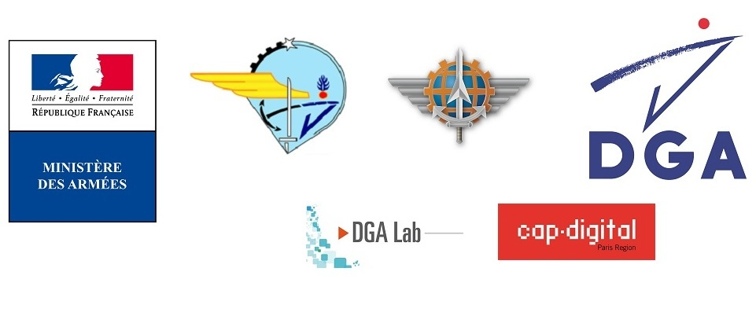
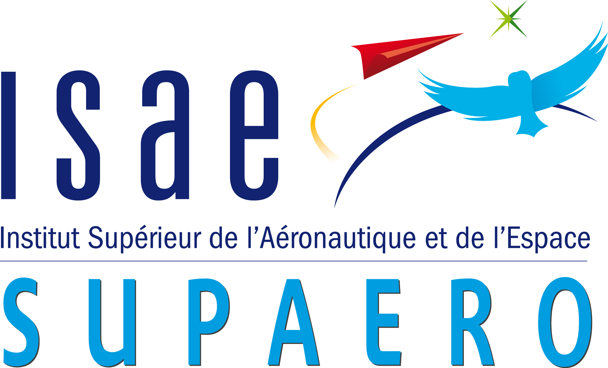
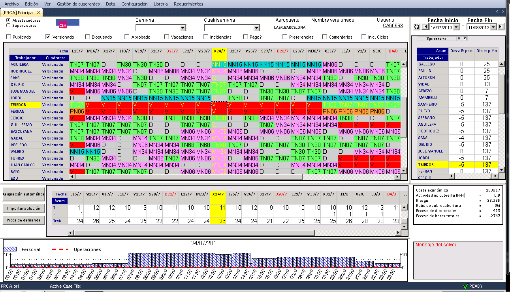
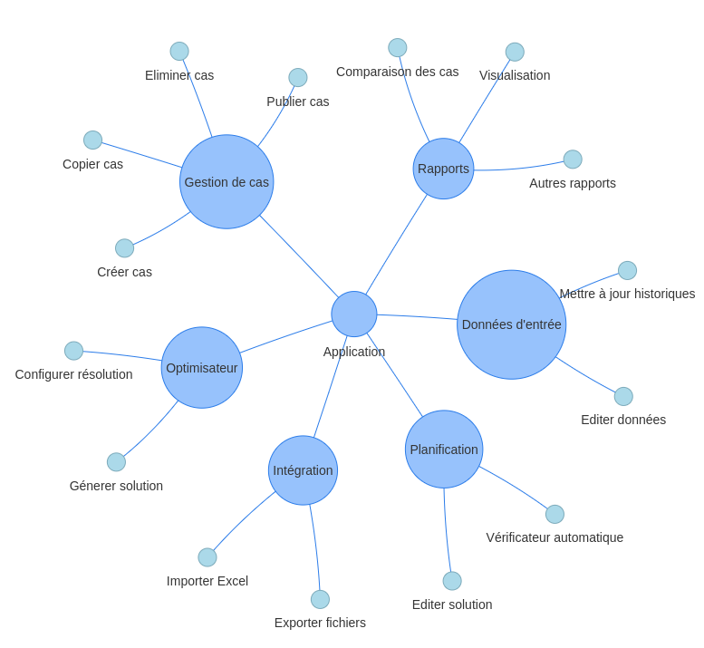
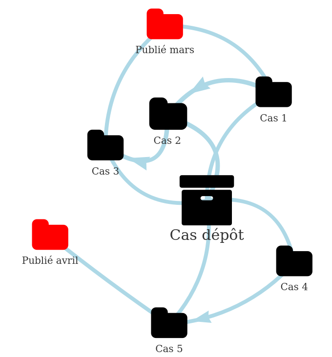

```{r setup, include=FALSE}
knitr::opts_chunk$set(echo = FALSE)
setwd("../")
source('diagrams/cases.R')
source("diagrams/architecture.R")
source("diagrams/functionalities.R")
html_output <- knitr::opts_knit$get("rmarkdown.pandoc.to") %in% c("slidy", 'html')
```

<!-- dfg -->
<!-- ```{r, echo=FALSE, out.width='80%'} -->
<!--  -->
<!-- ``` -->

<!-- ## Présentation de l'entreprise -->

<!-- Nom: ISAE-SUPAERO -->
<!-- Activité: école d’ingénieurs. -->

<!-- Grand école du secteur aéronautique et spatial, l'ISAE-SUPAERO développe depuis 2007 une recherche propre portée par ses département. Le département d'ingénierie des systèmes complexes (DISC), par son groupe Systèmes Décisionnels, travaille sur les outils de décision appliqués aux systèmes industriels, en particulier pour la production et la maintenance dans l'industrie aérospatiale. -->

<!-- ```{r, echo=FALSE, out.width='50%'} -->
<!--  -->
<!-- ``` -->

## Savoir-faire

* recherche scientifique, publication d’articles
* projets de recherche en collaboration avec l’industrie
* conception d’applications logicielles en planification et optimisation pour des entreprises

L’équipe a déjà encadré des travaux de recherche sur le sujet de la maintenance aéronautique. En outre, elle a une connaissance du problème en question car **une thèse doctorale** sur ce sujet a été lancée en octobre 2017. Les travaux ont été présentés à la conférence **ROADEF 2018** et seront présentés dans la conférence **MOSIM 2018**.

## Expérience: Génération des horaires du personnel

```{r, echo=FALSE, out.width='80%'}

```

## Fonctionalitées

```{r, echo=FALSE}
if (html_output){
    graph_functionalities()
} else {
    
}
```

## Moteur de planification: Modélisation mathématique 

* Notre point fort c'est la modélisation efficace.
* Nous avons dèjà des modèles faits pour ce problèm.
* Des alternatives d'hybridations vont être étudiées.

\begin{align}
& \sum_{t' \in \mathcal{T}^{s}_t} \sum_{i \in \mathcal{I}} m_{it'} + N_t \leq m_{max}
  & t \in \mathcal{T} \label{eq:capacity1}\\
& \sum_{t' \in \mathcal{T}^{s}_t} \sum_{i \in \mathcal{I}} m_{it'} + N_t + D_t\leq u_{max} 
  & t \in \mathcal{T} \label{eq:avalaibility1}\\
& \sum_{i \in \mathcal{I}_j} a_{jti} = R_j
        & j \in \mathcal{J}, t \in \mathcal{T}_j  \label{eq:taskres}\\
& \sum_{t' \in \mathcal{T}^{s}_t} m_{it'} + \sum_{j \in \mathcal{J}_t \cap \mathcal{O}_i} a_{jti} \leq 1 
        & t \in \mathcal{T}, i \in \mathcal{I} \label{eq:state}
\end{align}

<!-- ## Configuration -->

<!-- Les options disponibles seront: -->

<!-- * **Temps maximum**: dans le cas où une solution est nécessaire rapidement sans prouver l’optimalité. -->
<!-- * **Gap maximum**: afin d’autoriser une distance maximale entre la meilleure solution obtenue et la meilleure solution hypothétique possible. Cette distance peut être une différence proportionnelle ou une différence absolue. -->
<!-- * **Premier et dernier mois à planifier**: afin de définir l’horizon de planification. -->
<!-- * **Poids des objectifs**: pour optimiser les différents objectifs et privilégier un objectif ou un autre. -->
<!-- * **Paramètres de maintenance**: durée de maintenance (en mois), temps d’utilisation maximal, temps écoulé maximal et autres paramètres liés à la maintenance. -->

## Cas et expérimentation

Les fonctionnalités disponibles seront les suivantes:

* Créer un nouveau cas.
* Copier un cas existant.
* Supprimer un cas.
* Comparer deux cas.
* Publier un cas.
* Exporter un cas.

```{r, echo=FALSE}
if (html_output){
    graph_cases()
} else {
    
}
```

## Technologies et techniques

Tout les technologies à utiliser seront open source.\*

* **Modélisation mathématique**: pour modéliser les besoins des planifications.
* **Solveur mathématique**: pour générer les planifications.
* **Python**: pour la modélisation, l’heuristique et l’intégration de données.
* **R**: pour les statistiques, possibles prévisions et la visualisation des données.
* **PostgreSQL**: pour stocker des données.
* **HTML5**: pour les rapports, et les visualisations.

\* Le solveur est conditioné aux données et la taille du problème. Cela pourrait être CBC (libre), GUROBI ou CPLEX (payants) en fonction des besoins du modèle.

```{r, echo=FALSE, results='asis', out.width='15%'}
paths <- 
    c('postgresql.svg', 'Rlogo.png', 'python.png', 
      'coinor.jpg', 'html5.png') %>% sprintf('../../img/%s', .)
knitr::include_graphics(paths)

```
