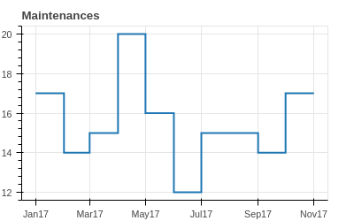
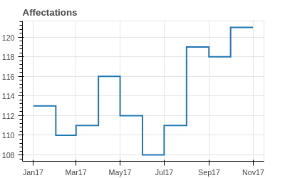

```{r setup, include=FALSE}
knitr::opts_chunk$set(echo = FALSE)
```

# Qui suis-je

* Péruvien et français.
* Ingénieur Industriel de l'Universidad Politecnica de Madrid.
* Passionné par les mathématiques appliqués et l'informatique.
* Fondé et travaillé dans une entreprise de conseil en optimisation et recherche opérationnelle à Madrid pendant les 7 derniers années.

# Où et avec qui je travaille

* A Toulouse à l'ISAE-SUPAERO.
* Plus spécifiquement dans le Département d'Ingénierie des Systèmes Complexes (DISC).
* Mes directeurs de thèse sont: Alain Haït et Olga Battaïa.
* Le sujet est issu d'une collaboration avec Nicolas Dupin de la DGA.

# Mon sujet de thèse: MFMP

> Military Flight and Maintenance Planning.

* Fait partie de la recherche opérationnelle: mathématiques dédiées à résoudre des problèmes complexes de l'industrie.
* Un problème d'affectation des missions et planification des maintenances des aéronefs militaires.
* Résolu par techniques comme PLNE, méta-heuristiques ou heuristiques.

# Exemple


```{r echo=FALSE}
#htmltools::includeHTML("./../../img/calendar.html")
```

# Exemple (2)

<!-- <style> -->
<!--   .col2 { -->
<!--     columns: 2 200px;         /* number of columns and width in pixels*/ -->
<!--     -webkit-columns: 2 200px; /* chrome, safari */ -->
<!--     -moz-columns: 2 200px;    /* firefox */ -->
<!--   } -->
<!-- </style> -->

<!-- <div class="col2"> -->


# Exemple (3)

```{r echo=FALSE}
# htmltools::includeHTML("./../../img/maintenances.html")
# htmltools::includeHTML("./../../img/unavailable.html")
```
<!-- </div> -->


# A quoi ça sert

* Faire de meilleures planifications pour une meilleure utilisation des ressources.
* Lisser les maintenances sur l'horizon de planification pour maximiser l'efficacité de l'équipe de maintenance.
* Garantir la disponibilité des aéronefs pour de possibles nouvelles missions.

# Pour quoi un doctorat?

* Ces types de problèmes sont difficiles à résoudre.
* Domaine scientifique: l'optimisation combinatoire.
* Pour trouver des bonnes solutions aux problèmes il faut souvent chercher la structure du problème, sa complexité et ses similitudes / differences avec d'autres problèmes.

<!-- # Etat de l'art -->

<!-- * En @Cho2011, des affectations quotidiens des heures aux avions militaires. -->
<!-- * En @Verhoeff2015 et @Kozanidis2008, des affectations mensuels des maintenances et opérations sont faits avec contraintes des disponibilité, niveau de service et soutenabilité. -->
<!-- * En @Chastellux2017, un premier modèle d'affectation de missions aux aéronefs en lieu des heures est présenté. -->


# Bibliographie

