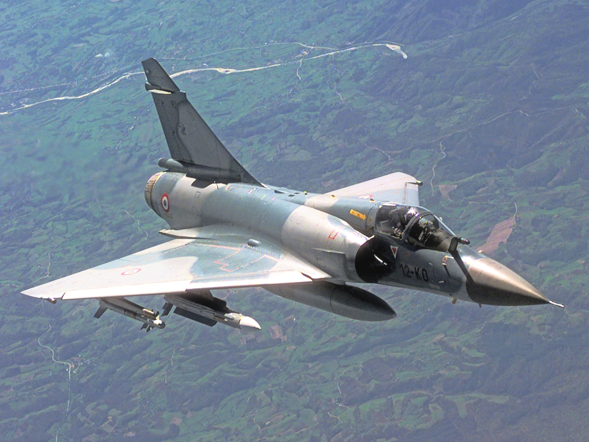

```{r, echo=FALSE, warning=FALSE}
library(RefManageR)
knitr::opts_chunk$set(echo = FALSE, warning=FALSE, message=FALSE)

BibOptions(check.entries = FALSE,
           bib.style = "authoryear",
           cite.style = "alphabetic",
           style = "markdown",
           hyperlink = FALSE,
           dashed = FALSE)
myBib <- ReadBib("./MFMP.bib", check = FALSE)

```

layout: true
  
<div class="my-header"></div>

<div class="my-footer"><span>ISAE-SUPAERO, Université de Toulouse, France    
&emsp;&emsp;&emsp;&emsp;&emsp;&emsp;&emsp;&emsp;&emsp;&emsp;&emsp;&emsp;&emsp;
&emsp;&emsp;&emsp;&emsp;&emsp;&emsp;&emsp;&emsp;&emsp;&emsp;&emsp;&emsp;&emsp;
&emsp;&emsp;&emsp;&emsp;&emsp;&emsp;
EDAA Journée doctorants 2020</span></div> 

---

### Structure of talk

1. Problem.
2. State of the art.
1. Solving techniques.
2. Machine Learning + Optimization.
2. Results.
3. Future work.
3. Publications.

---

### Military aircraft operations

.pull-left[

* Mirage 2000 fleet.
* Fleets of 60-80 aircraft.
* A single workshop to do the maintenance operations.
* Check type D (overhaul maintenances): 
  * every 5 years or 1000 flight hours and 
  * takes 4-6 months.
* Planning horizons of 90 periods (= 7.5 years).
* Missions require:
  * aircraft.
  * monthly flight hours.

]

.pull-right[
```{r, echo=FALSE, out.width='100%', warning=FALSE}

```
  
*French Mirage 2000C. Public Domain*
]

---

### Problem

```{r, echo=FALSE, out.width='100%', warning=FALSE}

```

A good solution:

* complies with all regulatory rules and mission demands.
* uses the least possible number of maintenances.
* keeps the fleet in a "good state" at every period.

---

### State of the art

* FMP: Flight and Maintenance Planning problem.
* In `r Citep(myBib, "Cho2011")`, US Army aircraft were assigned daily operations over a year to aircraft in order to minimize the maximum number of maintenances.
* In `r Citep(myBib, "Kozanidis2008")`, Greek aircraft had monthly assignments of maintenances and flight hours in order to maximize the availability and final state of squadrons.
* In `r Citep(myBib, "Verhoeff2015")`, monthly assignments were done and several objectives were taken into account: availability, serviceability and final state.
* In `r Citep(myBib, "Seif2018")`, a generalization for different types of maintenances and capacities was done.

---

### "Classical" solving techniques

$a_{ijt_1t_2}$: mission $j$ is assigned to aircraft $i$ between $t_1$ and $t_2$.  
$m_{ip}$: aircraft $i$ has a maintenance pattern $p$.

\begin{align}
  & \text{Min}\;
  \sum_{i \in \mathcal{I}, p \in \mathcal{P}} m_{ip} \times W_p \\
  & \sum_{i \in \mathcal{I}, p \in \mathcal{P}_{t}} m_{ip} \leq C^{max} 
          & t \in \mathcal{T} \label{eq:capacity1}\\
  & \sum_{i \in \mathcal{I}_j, (t_1, t_2) \in \mathcal{T}_{jt}} a_{ijt_1t_2} \geq R_j
          & j \in \mathcal{J}, t \in \mathcal{TJ}_j  \label{eq:missionres}\\
\end{align}

---

### Machine Learning + Optimization

We:

1. Train a statistical model to predict certain characteristics of good (optimal?) solutions for 5000 simulated instances.
2. Use this information to *predict* the characteristics of good solutions on a new instance ($\hat{\mu}_{t'-t}^{lb}$,  $\hat{\mu}_{t'-t}^{ub}$).
3. Apply the prediction to *guide* de solution of said instance.

--

\begin{align}
    & m_{ip} = 0 & p_{t'} - p_t < \hat{\mu}_{t'-t}^{lb} - tol  \\
    & m_{ip} = 0  &  p_{t'} - p_t > \hat{\mu}_{t'-t}^{ub} + tol
\end{align}

---

## Results

* 30% reduction in solution times.
* 40% more stable solutions.
* 3-4% optimality loss.

---

## Further steps

* **Better predictions** with better features, or predicting several characteristics of optimal solutions.
* **Warm-start Column Generation** with a selected subset of potentially good patterns.
* **Automatize prediction** so it can be easily integrated in other problems.

---

## Communications and publications

Conferences:

* **ROADEF2018**: Maintenance planning on French military aircraft operations.
* **MOSIM2018**: Bi-objective MIP formulation for the optimization of maintenance planning on French military aircraft operations.
* **CLAIO2018**: A novel MIP formulation for the optimization problem of maintenance planning of military aircraft.
* **AFIS2018**: Planning aircraft maintenances for the French Airforce.
* **ROADEF2020**: An alternative MIP formulation for the Military Flight and Maintenance Planning problem.

Journals:

* **OR Spectrum** (published): A novel solution approach with ML-based pseudo-cuts for the Flight and Maintenance Planning problem.
* **Annals of Operations Research** (submitted): Long term planning of military aircraft flight and maintenance operations
* **European Journal of Operations Research** (to be submitted): Novel Graph-based matheuristic to solve the Flight and Maintenance Planning problem

Partnerships:

* **Dasault Aviation**: desktop software built, tested, deployed and validated by users.

---

# References

```{r refs, echo=FALSE, results="asis"}
PrintBibliography(myBib)
```