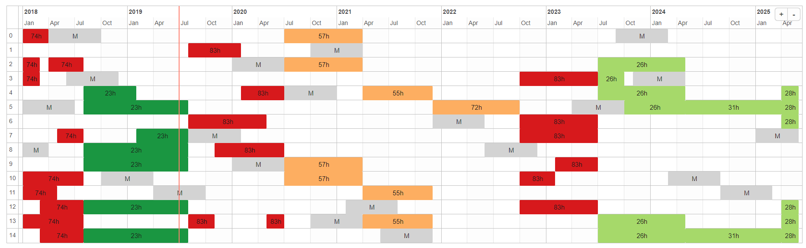

## Problem

## Problem (informally)

Assign both missions and maintenance operations to a fleet of aircraft in order to maximize availability and minimize costs. Missions have fixed start and end times and have particular needs in terms of aircraft and time.

## Problem (example)


```{r, echo=FALSE, out.width='70%'}


```

## Problem

* A series of $j \in \mathcal{J}$ tasks are planned along a horizon divided into $t \in \mathcal{T}$ periods. Since all tasks are already scheduled, we know time periods $T_j \subset \mathcal{T}$ in which they will be realized. 
* Each task requires a certain number $r_{j}$ of resources $i \in \mathcal{I}$ which it employs for a time duration defined by $h_j$ in each period.
* Resources require recurrent preventive maintenance operations since the realization of tasks diminish their remaining usage time.
* A maintenance operation takes exactly $m$ periods and cannot be interrupted. It restores the resource's remaining usage time to exactly $H$ units.

## Old variables

$a_{jti}$   &  =1 if mission $j \in J$ in period $t \in \mathcal{T}_j$ is realized with aircraft $i \in \mathcal{I}_j$, 0 otherwise.  
$a^s_{jti}$ &  =1 if aircraft $i$ starts a new assignment to mission $j$ in period $t$. If $a_{jti} = 1$ and $a_{j(t-1)i} = 0$.  
$m_{it}$    &  =1 if aircraft $i \in I$ starts a check in period $t \in \mathcal{T}$, 0 otherwise.  

```{r, echo=FALSE, out.width='70%'}


```

## New variables

$a_{ijtt'}$ & has value one if aircraft $i$ starts an assignment to mission $j$ at the beginning of period $t$ and finishes at the end of period $t'$, zero otherwise.  
$m_{itt'}$  & has value one if aircraft $i$ starts a check at the beginning of period $t$ and then starts the next check at the beginning of period $t'$ or does not have a second check ($t'=T$), zero otherwise.  

```{r, echo=FALSE, out.width='70%'}


```

## Distance between maintenance

* The distance between maintenance has a maximum of 60 periods.
* Depending on the amount of missions to do in a planning horizon, this can be shorter.
* The more room we leave as possible distance between maintenances, the more maintenance variables we have.

```{r, echo=FALSE, out.width='40%'}
imgs = c('mean_consum_vs_maints_dell_20190515_all.png', 'mean_consum_vs_cycle_2M_min_dell_20190515_all.png')
knitr::include_graphics(imgs)

```


## Forecasting + Optim

1. We train a statistical model to predict the expected distances between maintenances for any given instance.
2. We use this information to limit the possible combinations of two maintenances for the fleet.

## Benefits

1. **Performance**: a smaller model is easier to solve.
2. **User feedback**: direct feedback about the solution without needing to solve any model.

