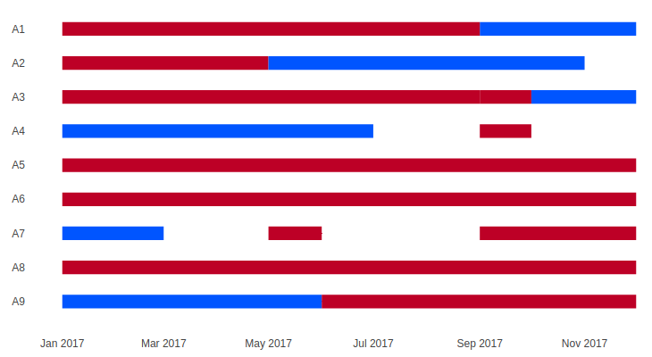
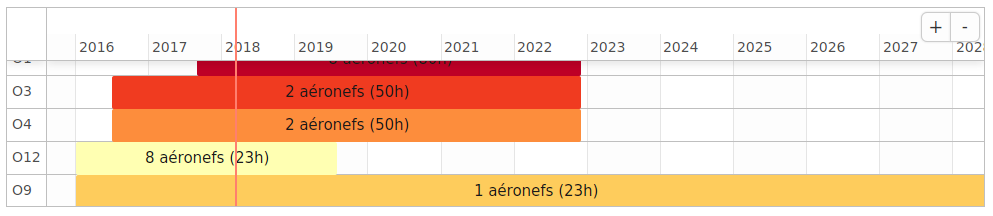
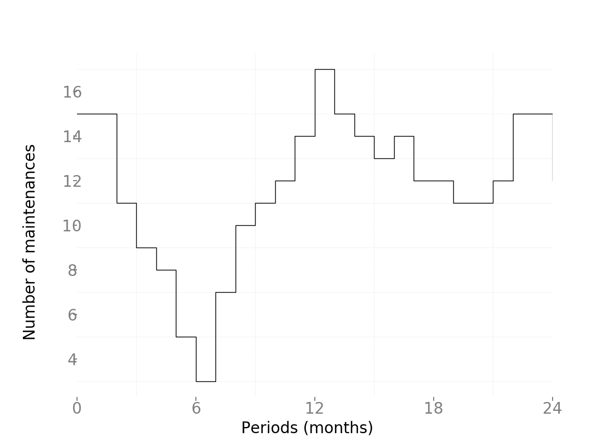
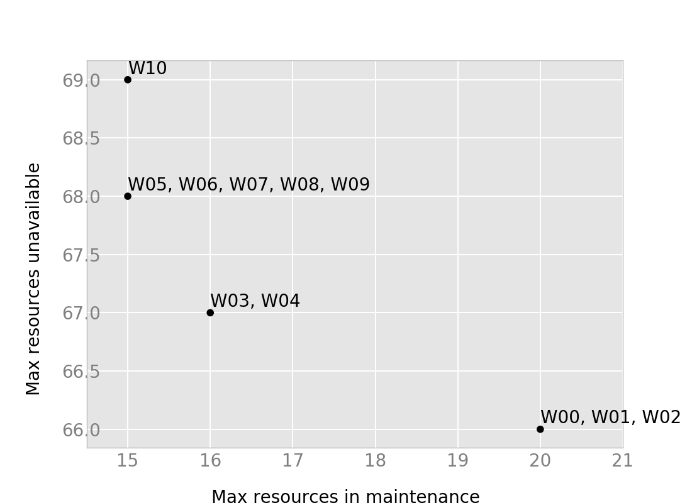

```{r setup, include=FALSE}
knitr::opts_chunk$set(echo = FALSE)
setwd("../")
source('scripts/params.R')
source('scripts/import_results.R')
exp_directory = PATHS[['experiments']] %>% paste0('201802141539/')
gantt <- print_solution(exp_directory, max_resources = 30)
show_gantt <- knitr::opts_knit$get("rmarkdown.pandoc.to")=="slidy"
```

<!-- # Introduction -->

<!-- ## Introduction -->

<!-- Flight and Maintenance Planning (FMP) problems are raised in civilian or military operational applications.  -->

<!-- They schedule maintenances of aircraft taking into account the implications of maintenance immobilizations for the demand in flight hours, for a conjoint optimization among maintenance dates and flight hours. -->

# Problem

## Problem (informally)

Assign both missions and maintenance operations to a fleet of aircraft in order to maximize availability and minimize costs. Missions have fixed start and end times and have particular needs in terms of aircraft and time.

## Problem (example)


```{r, echo=FALSE, out.width='70%'}

if (show_gantt){
    htmltools::HTML('<div style="font-size: 20px;width:100%">')
    gantt
    htmltools::HTML("</div>")
} else {
    
}

```


## Problem

* A series of $j \in \mathcal{J}$ tasks are planned along a horizon divided into $t \in \mathcal{T}$ periods. Since all tasks are already scheduled, we know time periods $T_j \subset \mathcal{T}$ in which they will be realized. 
* Each task requires a certain number $r_{j}$ of resources $i \in \mathcal{I}$ which it employs for a time duration defined by $h_j$ in each period.
* Resources require recurrent preventive maintenance operations since the realization of tasks diminish their remaining usage time.
* A maintenance operation takes exactly $m$ periods and cannot be interrupted. It restores the resource's remaining usage time to exactly $H$ units.

<!-- ## Relevance and origin -->

<!-- This thesis was started out of the need of the french Air Force to maximize the availability of their Mirage 2000 fleet while controlling cost and maintenance capacity. -->

<!-- In fact, a similar subject has been presented as a challenge in a open competition: Défit Opti-plan. -->

# State of the art

## State of the art (1)

* FMP: Flight and Maintenance Planning problem.
* In @Cho2011, US Army aircraft were assigned daily operations over a year to aircraft in order to minimize the maximum number of maintenances.
* In @Kozanidis2008, Greek aircraft had monthly assignments of maintenances and flight hours in order to maximize the availability and final state of squadrons.
* In @Verhoeff2015, monthly assignments were done and several objectives were taken into account: availability, serviceability and final state.
* In @Chastellux2017, an initial version of the model was done, assigning missions instead of only flight hours.

## State of the art (2)

* The present model deals with an heterogeneus fleet, with different standards and capacities.
* Multiple objectives have been incorporated in order to satisfy the French Air Force's specific needs.
* This model also features several improvements in the MIP modelling that permit greater instance sizes.

# Model

<!-- ## Model: sets -->

<!-- |Set|Description| -->
<!-- |-----|--------------------------------------------------------------------| -->
<!-- |    $\mathcal{I}$       |  resources. | -->
<!-- |    $\mathcal{T}$       |  time periods inside planning horizon. | -->
<!-- |    $\mathcal{J}$       |  tasks. | -->
<!-- |    $\mathcal{T}_j$     |  time periods $t \in \mathcal{T}$ in which task $j$ is active. | -->
<!-- |    $\mathcal{J}_t$    |  tasks $j \in \mathcal{J}$ to be realized in period $t$. | -->
<!-- |    $\mathcal{I}_j$     |  resources $i \in \mathcal{I}$ that can be assigned to task $j$. | -->
<!-- |    $\mathcal{O}_i$     |  tasks $j \in \mathcal{J}$ for which resource $i$ can be used. | -->
<!-- |    $\mathcal{T}^{s}_t$ |  time periods $t' \in \mathcal{T}$ such that $t' \in \{ \max{\{1, t - M+1\}},  ..., {t}$\}. | -->

<!-- ## Model: main parameters -->

<!-- |Parameters|Description| -->
<!-- |--------------|-------------------------------------------------| -->
<!-- | $H_j$ |  amount of **resource time required** by task $j$. | -->
<!-- | $R_j$ |  number of **resources required** by task $j$. | -->
<!-- | $M$   |  **maintenance duration** in number of periods. | -->
<!-- | $E$   |  remaining **elapsed time** after a maintenance. | -->
<!-- | $H$   |  remaining **usage time** after a maintenance. | -->


<!-- ## Model: more parameters -->

<!-- |Parameters|Description| -->
<!-- |--------------|----------------------------------------------------------------------| -->
<!-- | $N_t$              | number of resources in already-planned maintenances in period $t$ at the beginning | of the planning ho |izon.| -->
<!-- | $D_t$              | number of resources to be assigned in total in period $t$. | -->
<!-- | $Rut^{Init}_{i}$   | remaining usage time for resource $i$ at the start of the planning horizon. | -->
<!-- | $Ret^{Init}_{i}$   | remaining elapsed time for resource $i$ at the start of the planning horizon. | -->
<!-- | $Ret^{Init}_{sum}$ | sum of remaining elapsed times at the start of the planning horizon. | -->
<!-- | $Rut^{Init}_{sum}$ | sum of remaining elapsed time at the start of the planning horizon. | -->

<!-- ## Model: variables -->

<!-- | Variable   |  Description | -->
<!-- |-----------|------------------------------------------------------- | -->
<!-- | $a_{jti}$   |  =1 if **task** $j \in J$ in period $t \in \mathcal{T}_j$ **is realized with resource** $i \in \mathcal{I}_j$, 0 otherwise. | -->
<!-- | $m_{it}$    |  =1 if resource $i \in I$ **starts a maintenance** operation in period $t \in \mathcal{T}$, 0 otherwise. | -->
<!-- | $rut_{it}$  |  **remaining usage time** (continuous) for resource $i \in I$ at the end of period $t \in \mathcal{T}$. | -->
<!-- | $ret_{it}$  |  **remaining elapsed time** (integer) for resource $i \in I$ at the end of period $t \in \mathcal{T}$. | -->
<!-- | $u_{max}$   |  maximal number (integer) of **unavailable resources** in any period. | -->
<!-- | $m_{max}$   |  maximal number (integer) of **resources in maintenance** in any period. | -->

<!-- ## Model: main constraints -->

<!-- Requirements per task: -->
<!-- ```{r out.width="250px", echo=FALSE} -->
<!--  -->
<!-- ``` -->
<!-- \pause -->

<!-- Max maintenances: -->
<!-- ```{r out.width="150px", echo=FALSE} -->
<!--  -->
<!-- ``` -->


<!-- ## Model: main constraints -->

## Model: objective function

<div class="incremental">

\begin{align}
    & \text{Min}\; W_1 m_{max} + W_2 u_{max}
\end{align}

\pause

The two components of the objective function: the max number of maintenance and the max number of unavailable aircraft.
\begin{align}
    &\sum_{t' \in \mathcal{T}^{s}_t} \sum_{i \in \mathcal{I}} m_{it'} + N_t \leq m_{max}
    &t \in \mathcal{T} \\
    &\sum_{t' \in \mathcal{T}^{s}_t} \sum_{i \in \mathcal{I}} m_{it'} + N_t + D_t\leq u_{max}
    &t \in \mathcal{T}
\end{align}

</div>

## Model: main constraints

Mission's needs and incompatibility of several tasks or maintenance in the same period.
\begin{align}
&\sum_{i \in \mathcal{I}_j} a_{jti} = R_j
&j \in \mathcal{J}, t \in \mathcal{T}_j\\
&\sum_{t' \in \mathcal{T}^{s}_t} m_{it'} + \sum_{j \in \mathcal{J}_t \cap \mathcal{O}_i} a_{jti} \leq 1
& t \in \mathcal{T}, i \in \mathcal{I}
\end{align}

<!-- ## Model: flow constraints -->

<!-- Visualization of accumulated time constraints for one resource. -->

<!-- ```{r out.width="250px", echo=FALSE} -->
<!-- # img <- readPNG("./../../img/balance2.png") -->
<!-- #  grid.raster(img) -->
<!--  -->
<!-- ``` -->

## Model: flow constraints

Time usage of an aircraft depending on the assignment to a task.
<!-- <div class="incremental" style="margin-left: 4em; position: relative">  -->
<!--   <div style="position: absolute; left: 0; top: 0;background-color:white;width:100%"> -->
\begin{align}
& rut_{it} \leq rut_{it-1} + H m_{it} - \sum_{j \in \mathcal{J}_t \cap \mathcal{O}_i} a_{jti} H_j & t =1, ..., \mathcal{T}, i \in \mathcal{I}\\
& rut_{i0} = Rut^{Init}_i
        & i \in \mathcal{I}\\
& rut_{it} \geq H m_{it}
        & t \in \mathcal{T}, i \in \mathcal{I}\\
& rut_{it} \in [0,H]
        & t \in \mathcal{T}, i \in \mathcal{I} \\
& \sum_{i \in \mathcal{I}} rut_{it} \geq Rut^{Init}_{sum}
        & t = |\mathcal{T}|
\end{align}

  <!-- </div>  -->
  <!-- <div style="position: absolute; left: 0; top: 0;background-color:white;width:100%"> -->
  
## Model: flow constraints

Elapsed times are treated in the same way but consumption is expressed in time periods.
\begin{align}
& ret_{it} \leq ret_{it-1} + E m_{it} - 1 & t =1, ..., \mathcal{T}, i \in \mathcal{I}\\
& ret_{i0} = Ret^{Init}_i
        & i \in \mathcal{I}\\
& ret_{it} \geq E m_{it}
        & t \in \mathcal{T}, i \in \mathcal{I}\\
& ret_{it} \in [0,E]
        & t \in \mathcal{T}, i \in \mathcal{I} \\
& \sum_{i \in \mathcal{I}} ret_{it} \geq Ret^{Init}_{sum}
        & t = |\mathcal{T}|
\end{align}


# Results

## Experiments

The following instances were tested:

| id | $\|\mathcal{J}\|$ |$\|\mathcal{T}\|$ |  assign |  objective  |  time (s) |   bound |
|-----|------------------|------------------|---------| ------------| -----------| --------|
| I_0 |                9 |               11 |     310 |        62.0 |        0.7 |    62.0 |
| I_1 |                9 |               21 |     650 |        63.0 |       68.7 |    63.0 |
| I_2 |                9 |               31 |     990 |        63.0 |     3600.1 |    62.0 |
| I_3 |                9 |               41 |    1249 |        64.0 |     3603.9 |    61.7 |
| I_4 |               10 |               11 |     530 |        82.0 |        0.9 |    82.0 |
| I_5 |               10 |               21 |    1070 |        83.0 |      144.0 |    83.0 |
| I_6 |               10 |               31 |    1610 |        83.0 |     3600.1 |    82.0 |
| I_7 |               10 |               41 |    2069 |        84.0 |     3609.1 |    81.8 |
| I_8 |               11 |               11 |    1080 |       139.0 |      530.6 |   139.0 |
| I_9 |               11 |               21 |    2120 |       149.0 |     3600.0 |   139.9 |

## Sample solution progress

The analysis of the solution progress for all instances shows that:

* Initial solutions are quite far from the linear relaxation.
* Branching does not improve significantly the lower bound.

\pause
```{r out.width="150pt", echo=FALSE}
knitr::include_graphics("./../../img/progress.png.png")
```

*(Progress diagram for instance id=I_7).*

## Multi-objective (1)

Comparison of two objectives: max availability or maintenance capacity.
Different weights were used for the two objectives: $W_1, W_2 \in [0..1]$ with pace of 0.1.
\pause
```{r out.width="180pt", echo=FALSE}

```

*(Pareto diagram for instance id=I_5).*

## Multi-objective (2)

* Analysis for all instances: not many pareto optimal points available (between two and four).
* The objectives are quite aligned one with the other.

# Next steps
## Next steps

* **Try different objective formulations**: availability - maintenability - future state.
* **Try more linent objectives**: relax the `max` in the objective.
* **Break symmetries**: clustering candidates, fixing end availabilities.
* **Add more constraints**: minimal duration of assignments, storage of aircraft.

# References
## References / Questions?

<!-- \bibliographystyle{dcu} -->
<!-- \bibliography{./../biblio/MFMP} -->
