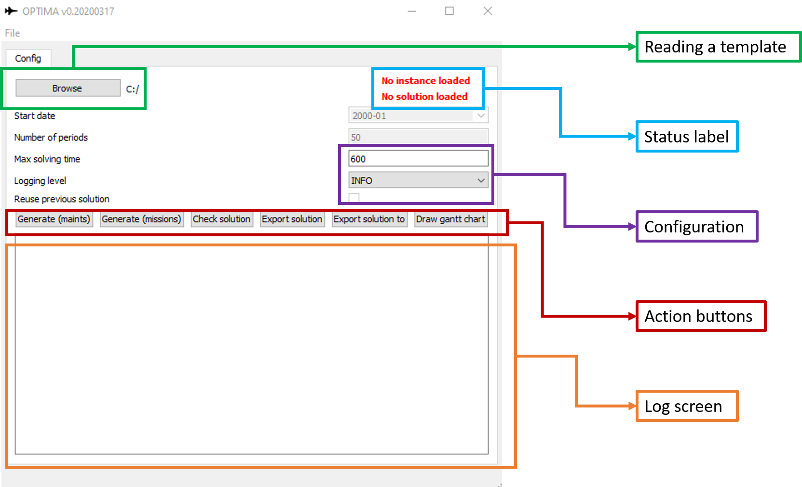

Graphical User Interface
**************************

  Optima's graphical user interface

Status label
-----------------

There are two status labels at the top right corner of the screen. They indicate if an instance (input data) has been loaded and if a solution to that instance has been loaded.

By reading a template (see below), one can load the instance and, if a solution is available, a solution.

When the algorithm finishes with a solution, it update the status label too.

Reading a template
------------------------------

By clicking "Browse", a directory is selected to import a template file.
The directory should have, at least, one `template_in.xlsx` file.

Configuration
---------------

At the moment three configuration options are available. All three apply only to the maintenance generation algorithm.

**The maximum time** allowed to search for solutions.

**The logging level** which control how much information appears as log of the solution process. Options are "INFO" (default) and "DEBUG" (more detail).

**The reuse of the previous solution** permits to initialize the solution process with the solution read from the `template_out.xlsx` file. in this way, the algorithm starts with this solution.

Log screen
---------------

The log screen shows the log of the last solving process. This includes the maintenance planning and the mission planning.

Action buttons
---------------

Generate (maints)
==================

This button calls the simulated annealing algorithm to generate a new maintenance plan for the current input data.

Generate (missions)
=====================

This button takes a solution from the previous algorithm and assigns a mission plan.

Check solution
==================

This button runs a series of checks on the current solution and lists all the possible problems with it. A solution obtained with the previous algorithms can obtain a solution with errors.

Export solution / Export solution to
======================================================

These buttons export the whole input data+solution to a directory.

Draw gantt
==================

This button generates an html gantt representation of the solution so it is easier to interpret.

